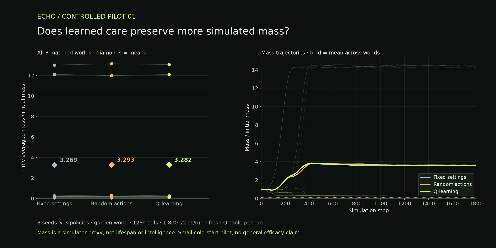

# ECHO — Living Memory Lab

An independent browser artificial-life experiment: observe a simulated world, let an experimental caretaker adjust its environment, and save a record of what happened.

Built on [Genesis Engine by teknium1](https://github.com/teknium1/genesis-engine), under the MIT license. ECHO is a derivative project, with no implied affiliation or endorsement from the upstream author.

## Run locally

Requires Python 3 and a browser supporting WebGL2 and `EXT_color_buffer_float`. No API key, backend service, or npm dependencies are required.

```sh
python3 -m http.server 8099 --bind 127.0.0.1 --directory dist
```

Open **http://127.0.0.1:8099**. Serve the files over HTTP; opening `index.html` directly does not load JavaScript modules correctly.

## Explore

- Four starting worlds rendered on a 128 × 128 GPU simulation grid.
- Pause, step, restart, and switch between fixed and tracking camera modes.
- Adjust light and mutation, or enable the tabular Q-learning caretaker.
- Save and restore local checkpoints, including simulation state and learned values.
- Export/import worlds as JSON and export branded PNG frames.
- Inspect the event journal and mass/energy measurements.

Checkpoints use IndexedDB in the current browser. Export a checkpoint before changing devices or clearing browser data. Closing the page stops the simulation; it does not continue on a server.

## What ECHO adds

| Component | Origin |
| --- | --- |
| GPU engine, starting worlds, metrics, and shader foundation | Genesis Engine by teknium1 |
| Application interface and controls | ECHO |
| Experimental Q-learning caretaker | ECHO |
| Local checkpoints, event journal, world import/export | ECHO |
| Matched-world benchmark, raw data, analysis, and plots | ECHO |

ECHO adapts upstream rendering, including colors and aspect-ratio handling. See [THIRD_PARTY_NOTICES.md](THIRD_PARTY_NOTICES.md) and [LICENSE](LICENSE).

## Research: a controlled pilot

Eight matched seeds × three policies × 1,800 simulation steps: **24 primary runs**, plus one repeat check. Each learned controller starts untrained. The primary outcome is the time-averaged ratio of simulated mass to initial mass.

| Policy | Mean mass ratio | Sustained-decline detections |
| --- | ---: | ---: |
| Fixed settings | 3.268706 | 6 / 8 |
| Random actions | 3.292528 | 6 / 8 |
| Q-learning caretaker | 3.282147 | 6 / 8 |

**No consistent Q-learning advantage was demonstrated.** Its group mean was 0.41% above fixed settings and 0.32% below random actions. Two expanding worlds dominate the means. This is a short cold-start pilot with only eight completed Q updates per learned run; it does not establish general performance.



Read the [protocol](benchmark/PROTOCOL.md), [raw results](benchmark/raw-results.json), [per-run CSV](benchmark/per-run.csv), and [reproduction instructions](benchmark/README.md). Source checksums accompany the benchmark snapshot. GPU differences can affect reproduction.

```sh
cd benchmark
python3 serve.py
# Open http://127.0.0.1:8101 and click Run benchmark.
```

## What this experiment does not establish

The simulated cells are not an LLM. The caretaker is an external tabular learning controller, not a neural network inside each creature. “Memory” means saved world state, Q-values, and an event journal; it does not mean consciousness or autobiographical recall.

The experiment does not demonstrate intelligence, guaranteed survival, or sustained open-ended evolution. Simulated mass is not a measure of intelligence or organism lifespan.

This repository contains no token contract, wallet integration, sale mechanism, or on-chain simulation. No token address is verified here. Research results do not establish token utility or investment value.

## Checks

Requires Node.js 20 or newer:

```sh
node --test tests/*.test.js
node --check dist/js/app.js
```

The unit tests cover caretaker feedback, finite learning values, serialization, and repeatable world initialization. They do not validate GPU rendering or prove evolutionary behavior. The supplied pilot used the separate benchmark snapshot in `benchmark/source`.

## License

MIT. Retain the upstream copyright and permission notice when redistributing upstream code. See [LICENSE](LICENSE) and [THIRD_PARTY_NOTICES.md](THIRD_PARTY_NOTICES.md).

## September 25 full review

Build `2026.09.25-c` uses deterministic preset seeds, matched default bodies, and zero initial mutation in both modes. Learning is opt-in. See [review and limitations](dist/research/full-review/README.md), [eight 10000-step default runs](dist/research/full-review/defaults.json), and [24 stress cases including collapses](dist/research/full-review/stress.json). These are engineering regressions, separate from Pilot 01. Both energy equations and starting layouts have changed; old screenshots and benchmark numbers do not describe the current default simulation.
